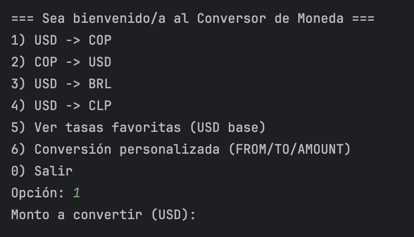
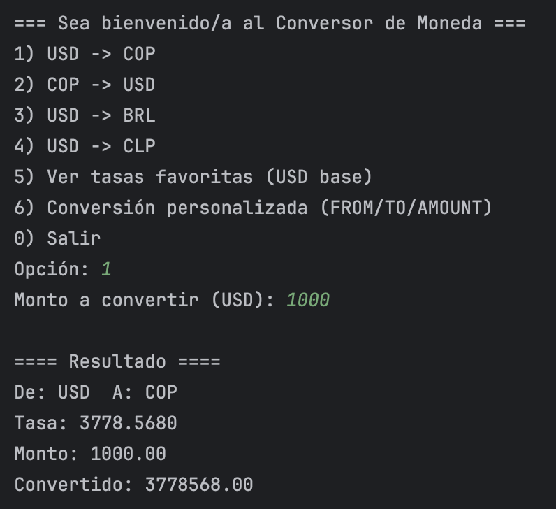

# Conversor de Moneda (Java + ExchangeRate-API)

Proyecto del desafío: un conversor de monedas por consola que consume la **ExchangeRate-API**, parsea JSON con **Gson** y muestra conversiones y tasas filtradas.

> Hecho con IntelliJ, JDK 25 (sirve 17+), `HttpClient/HttpRequest/HttpResponse` y **Gson**.

---

## Demo

### Menú principal


### Ejecución de ejemplo (USD → COP)


---

## Funcionalidades

- Conversión **USD ⇄ COP** y cualquier par soportado por `/pair/{from}/{to}/{amount}`.  
- Modo **CLI** interactivo con menú en bucle (`Scanner`).  
- **Filtrado** de tasas favoritas desde `/latest/{BASE}` (p. ej. `USD`, `ARS`, `BOB`, `BRL`, `CLP`, `COP`).  
- Manejo básico de **errores** (códigos HTTP, `result != "success"`).  
- **Redondeo** amigable en la salida.

---

## Requisitos

- Java **17+** (usé **JDK 25**).  
- **IntelliJ IDEA** (Community está bien).  
- Clave gratuita de **ExchangeRate-API**: <https://www.exchangerate-api.com/>

---

Cómo correr

Clona/abre el proyecto en IntelliJ.

Verifica que libs/gson-2.13.2.jar esté agregado como dependencia
(File → Project Structure → Modules → Dependencies).

Ejecuta la clase app.ConversorCLI.

Sigue el menú para convertir monedas o ver tasas favoritas.

Alternativa (Terminal, desde el root del proyecto):

javac -cp libs/gson-2.13.2.jar src/app/*.java -d out
java  -cp "out:libs/gson-2.13.2.jar" app.ConversorCLI

Endpoints usados

Ping/latest:
https://v6.exchangerate-api.com/v6/{API_KEY}/latest/USD

Par con monto:
https://v6.exchangerate-api.com/v6/{API_KEY}/pair/{FROM}/{TO}/{AMOUNT}

## Configurar la API Key

.../pair/USD/COP/150

Tecnologías

Java 17+ / JDK 25

java.net.http.HttpClient (HttpRequest, HttpResponse)

Gson (parseo JSON)

IntelliJ IDEA

Estructura (resumen)

.
├── libs/
│   └── gson-2.13.2.jar
├── docs/
│   ├── img/
│   │   ├── menu-cli.png
│   │   └── run-usd-cop.png
│   ├── index.md
│   └── readme.md
├── src/
│   └── app/
│       ├── ConversorCLI.java
│       ├── HttpUtil.java
│       └── ...
└── README.md

### Importante
- En **`docs/index.md`** deja el enlace así:
  ```md
  - Repo: [README](./readme.html)

```bash
EXCHANGE_API_KEY=TU_CLAVE
